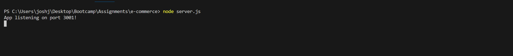
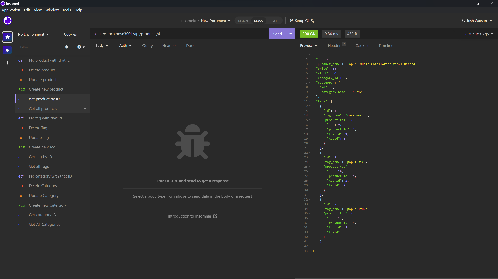

# E-commerce back end 

## Description 
This is for the backend of an e-commerce application

Video Walkthrough Link: 
https://drive.google.com/file/d/1fWlk4k7y-y0TlgYXdQ61wMjCMq1vy_zQ/view 

## Screenshots

This is the command line after running node server.js

This is a screenshot from insomnia when I demo get product by ID.

## Table of contents
- [Go to Installation](#installation) 
- [Go to Usage](#usage) 
- [Go to Contributing](#contributing) 
- [Go to Tests](#tests)
- [Go to License](#license)
- [Got to Questions](#questions)

## Installation
when in the command line, run npm install. then run source schema.sql to initialise the db. After that, run node server.js to run the program.
    
## Usage
The usage for this program is  for the backend of an e-commerce site. To help add and remove certain products in certain catergories in heroku.

## Contributing
N/A

## Tests
N/A

## License

## Questions

Please checkout my Github account: https://github.com/Joshua-Watson96 

Please e-mail me with any further questions:  joshjkwatson@gmail.com